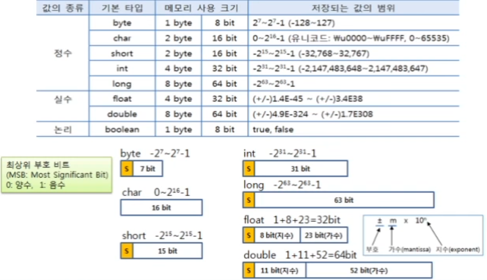
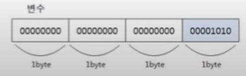
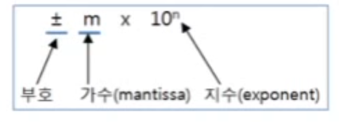

# 목차
- [목차](#목차)
- [데이터 타입](#데이터-타입)
  - [기본(primitive)타입](#기본(primitive)타입)
    - [정수타입](#정수타입)
      - [byte타입](#byte타입)
      - [char타입](#char타입)
      - [short타입](#short타입)
      - [int타입](#int타입)
      - [long타입](#long타입)
    - [실수타입](#실수타입)
    - [논리타입](#논리타입)
# 데이터 타입
## 기본(primitive)타입
- 1byte = 8 bite
  - `0` `0` `0` `0` `0` `0` `0` `0`



## 정수타입
정수 타입|byte|short|int|long
:------:|:------:|:------:|:------:|:------:
바이트 수|1|2|4|8
### byte타입
- 1byte 부호있는(signed)정수값 저장
  - 값의 범위: -128~127
  - 초과 : 컴파일에러 `ex` byte b = 128;(컴파일에러)
- 실행 중에 값의 범위를 초과할 경우
  - 최소값붜 다시 반복 저장
  - 127을 넘으면 -128부터 다시 시작
  ```java
  byte b = 127;    byte b = -128;
  b++;             b--;
  b의 값은 ? -128   b의 값은? 127
  ```
  ### char타입
- 2byte 부호없는(unsigned)정수값 저장
- char 타입에는 한문자를 [유니코드](http://www.unicode.org)로 저장
  - 세계 각국의 문자들을 2byte(0-65535) 표현되는 코드값으로 매핑한 국제표준규약
  - 0-127: 아스키(ASCII) 문자(특수기호, 숫자, 영어 알파벳), 44032-55203: 한글문자
- 하나의 문자 리터럴은 작은 따옴표(')로 감싸야 한다.
```java
char var1 = 'A'; //유니코드 : 0x0041 => 2진수 : 00000000 01000001
char var2 = 'B'; //유니코드 : 0x0042 => 2진수 : 00000000 01000010
char var3 = '가'; //유니코드 : 0xAC00 => 2진수 : 10101100 00000000
char var4 = '나'; //유니코드 : 0xAC01 => 2진수 : 10101100 00000001
```
- 직접 유니코드 정수 값을 저장할 수도 있다.
```java
char c = 65;
char c = '\u0041';
```
- 유니코드를 알고 싶을 경우
```java
char c = 'A';
int uniCode = c;
```
`참고`
-
- 문자와 문자열은 다르다.
  - 문자열은 큰따옴표로 리터럴을 작성한다.
  - String 타입에 저장한다.
  - String name = "홍길동";
- 빈(empty) 문자 처리
  - cahr c = ''; => 컴파일 에러
  - char c = ' '; => 공백(유니코드:32) 가능
  - String str = "" => 가능

### short타입
- 2byte 부호있는(signed) 정수값 저장 : -32,768 ~ 32,767 (-2<sup>15</sup> ~ 2<sup>15</sup>-1)
- C언어와 타입 호환을 위해 사용되며 비교적 자바에서는 잘 사용되지 않는 타입

### int타입
- 4byte 부호 있는(signed) 정수값 저장 : -2,147,483,648 ~ 2,147,483,647 (-2<sup>31</sup>~2<sup>31</sup>-1)
```java
int number = 10;
int octNumber = 012;
int hexNumber = 0xA;
```
변수에 어떤 진수로 저장을 하더라도 동일한 값이 이진수로 변환되어 저장된다. 10이 int 타입 변수에 저장되면 메모리에 생성되는 변수는 다음과 같다.   
int 가 4byte 의 크기를 가지기 때문에 4byte 의 공간을 차지하면서 총 32bit 로 10 을 표현한다.



10은 1byte 로 충분히 표현이 가능하기 때문에 나머지 상위 3byte 는 모두 bit 값이 0 이다.

### long타입
- 8byte 부호 있는(signed) 정수값 저장
  - -9,233,372,036,854,775,808 ~ 9,233,372,036,854,775,807 (-2<sup>63</sup>~2<sup>63</sup>-1)
- 값의 표현
  - int 범위의 리터럴은 상관없음
  - int 범위를 초과하는 리터럴은 반드시 L(대문자) 또는 l(소문자)을 붙여야 된다.
```java
long var1 = 10;
long var2 = 20L;
long var3 = 100000000000000; //컴파일 에러
long var4 = 100000000000000L;
```

## 실수타입

실수타입|float|double
:------:|:------:|:------:
바이트 수|4|8

- 부동 소수점(floating-point) 방식으로 저장   

  - `가수`:0<=m<1 범위의 실수
    - 1.2345 => 0.12345 X 10<sup>1</sup>
  - 동일한 메모리 크기를 가지는 int와 long 보다 더 큰 수를 저장할 수 있음
    - `float` : 부호(1bit) + 지수(8bit) + 가수(23bit) = 32bit = 4byte   
`1` `지수 (8bit)` `가수 (23bit)`   
    - `double` : 부호(1bit) + 지수(11bit) + 가수(52bit) = 64bit = 8byte   
    `1` `지수 (11bit)` `가수 (52bit)`  
- 실수 리터럴의 기본 타입은 double 이다.
  - float 리터럴은 끝에 F(대문자)또는 f(소문자)를 붙인다.   
```java
double var1 = 3.14;
float var2 = 3.14; //컴파일 에러(Type mismatch; cannot convert from double to float)
float var3 = 3.14F;
```
- 정수 리터럴에 10의 지수를 나타내는 E 또는 e가 포함되어 있을경우
  - 실수 타입에 저장해야 한다.
  ```java
  int var6 = 3000000; //3000000
  double var7 = 3e6; //3000000
  float var8 = 3e6f; //3000000
  double var8 = 2e-3; //0.002
  ```
## 논리타입
 - boolean
    - 1byte 의 크기를 가지며 논리값 `true` 또는 `false` 를 저장
    - 두가지 상태값을 저장할 필요성이 있을 경우 사용
    - 조건문, 제어문의 실행 흐름을 변경할 때 주로 이용