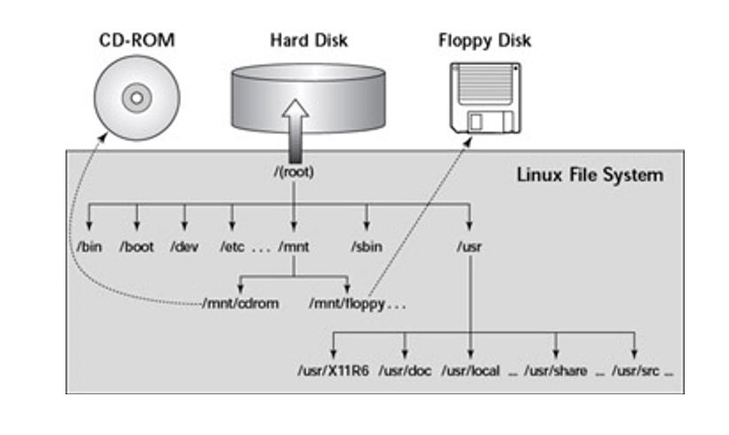

# mount
- 보조기억장치 등의 장치를 / (`루트`)의 하위 디렉터리로 연결하여 사용 가능하게 해주는 명령어.

## 리눅스 파일 시스템 예시

## 명령어
> mount `options` `device` `directory`
- 아무 옵션없이 mount 명령어를 실행 했을 경우 마운트된 정보를 확인가능.

## 옵션

- `-a` /etc/fstab 에 명시된 파일 시스템을 마운트할 때 쓰이는 옵션.
- `t` `fs_type` 파일 시스템의 유형을 지정하는 옵션으로 지정하지 않으면 /etc/fstab 파일을 참조.
- `-o` `항목` 마운트할 때 추가적인 설정을 정용할 때 사용하는 옵션.
  - 다수의 조건을 적용할 때는 콤마(`,`)로 구분.
  - `-o` 주요 항목
  > `ro` 읽기 전용으로 마운트  
  > `rw` 읽기 쓰기 모드로 마운트(기본값)  
  > `remount` 해당 파티션을 다시 마운트, 파티션 정보를 바꾸었을 때 사용.   
  > `loop` loop 디바이스로 마운트할 때 사용. iso를 마운트해서 사용할 때 사용.  
  > `noatime` 파일의 내용을 읽게 되면 access time이 변경되는데 이 옵션을 사용하면 파일이 변경되기 전까지는 access time이 변경되지 않음.
  >> 시스템의 작업을 줄여 성능 향상의 효과.  
  >> 노트북에서 사용하면 디스크 접근에 따른 배터리 시간 증대.