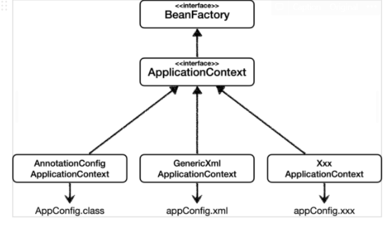
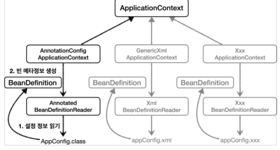

# 목차
- [목차](#목차)
- [IoC](#IoC)
  - [IoC란?](#IoC란?)
  - [IOC 컨테이너란?](#IOC-컨테이너란?)
  - [빈 팩토리와 애플리케이션 컨텍스트](#빈-팩토리와-애플리케이션-컨텍스트)
  - [설정 메타 정보](#설정-메타-정보)
  - [스프링 빈 설정 메타 정보](#스프링-빈-설정-메타-정보)
- [DI](#DI)
  - [Dependency(의존 관계)란?](#Dependency(의존-관계)란?)
  - [Dependency를 인터페이스로 추상화](#Dependency를-인터페이스로-추상화)
  - [DI(의존 관계 주입)란?](#DI(의존-관계-주입)란?)
# IoC
## IoC란?
* IoC는 Inversion of Control 의 줄임말이며, 제어의 역전 이라고 한다.
* 스프링 애플리케이션에서는 오브젝트(Bean) 생성, 의존관계 설정, 사용, 제거 등의 작업을 개발자 대신 컨테이너가 담당한다.
* 이를 컨테이너가 오브젝트에 대한 제어권을 갖고 있다고 해서 IoC라고 부른다.
* 스프링 컨테이너를 IoC 컨테이너 라고도 한다.

## IOC 컨테이너란?
* 스프링에서는 IoC를 담당하는 컨테이너를 빈팩토리,DI 컨테이너, 에플리케이션 컨텍스트라고 부른다.
* 오브젝트의 생성과 오브젝트 사이의 런타임 관계를 설정하는 DI관점으로 보면 컨테이너를 빈 팩토리 또는 DI 컨테이너라고 부른다.
* 그러나 스프링 컨테이너는 단순한 DI 작업보다 더 많은 일을 하는데, DI를 위한 빈 팩토리에 여러가지 기능을 추가한 것을 애플리케이션 컨텍스트 라고 한다.
* 애플리케이션 컨텍스트는 그 자체로 IoC와 DI 그이상의 기능을 가졌다고 보면 된다.

## 빈 팩토리와 애플리케이션 컨텍스트
빈 팩토리와 애플리케이션 컨택스트 관계   
  
* 빈팩토리
  * 스프링 컨테이너의 최상위 인터페이스이다.
  * 스프링 빈을 관리하고 조회하는 역할을 담당한다.
* 애플리케이션 컨텍스트
  * 애플리케이션 컨텍스트는 빈팩토리 기능을 모두 상속 받아서 제공한다.
  * 위의 인터페이스에서 extends 한 인터페이스들은 모두 빈 팩토리 인터페이스의 서브 인터페이스 이며, 빈팩토리에게 없는 추가 기능을 가지고 있다. 따라서, 애플리케이션은 이를 혼합하여 다음과 같은 기능을 제공한다.
    * 메세지 소스를 활용한 국제화 기능
      * 한국에서 들어오면 한국어로, 영어권에서 들어오면 영어로 출력
    * 환경변수
      * 로컬, 개발, 운영 등을 구분해서 처리
    * 애플리케이션 이벤트
      * 이벤트를 발행하고 구독하는 모델을 편하게 지원
    * 편리한 리소스 조회
      * 파일, 클래스패스, 외부 등에서 리소스를 편리하게 조회

## 설정 메타 정보

* IoC 컨테이너의 가장 기초적인 역할을 오브젝트를 생성하고 이를 관리하는 것이다.   
* 스프링 컨테이너가 관리하는 이런 오브젝트는 빈이라 부른다.   
* 설정메타 정보는 이 빈을 어떻게 만들고 어떻게 동작하게 할 것인가에 관한 정보이다.   
* 스프링 컨테이너는 자바코드, XML, Groovy등 다양한 형식의 설정 정보를 받아들일 수 있도록 유연하게 설계되어 있다.   
   

## 스프링 빈 설정 메타 정보

* 스프링은 어떻게 이런 다양한 형식을 지원하는 것일까? 그 중심에는 BeanDefinition 이라는 추상화가 있다.
* 쉽게 말하자면 XML, 자바 코드를 읽어서 BeanDefinition 을 만든다. 따라서 스프링 컨테이너는 오직 BeanDefinition만 알면 된다.
* BeanDefinition을 빈 설정 메타 정보라 하는데, @Bean과 <bean>당 각각 하나씩 메타 정보가 생성된다.
  
* AnnotationConfigApplicationContext는 AnnotatedBeanDefinitionReader를 사용해서 AppConfig.class를 읽고 BeanDefinition을 생성한다.
* GenericXmlApplicationContext는 XmlBeanDefinitionReader를 사용해서 appConfig.xml 설정 정보를 읽고 BeanDefinition을 생성한다.
* 새로운 형식의 설정 정보가 추가되면, XxxBeanDefinitionReader를 만들어서 BeanDefinition을 생성하면 된다.

# DI
## Dependency(의존 관계)란?
* “A가 B를 의존한다”는 굉장히 추상적인 표현이지만, 토비의 스프링에서는 “의존 대상 B가 변하면, 그것이 A에 영향을 미친다”고 한다. 즉, B의 기능이 추가되거나 변경되면 그 영향이 A에 미치는 것이다.
```java
class BurgerChef {
    private HamBurgerRecipe hamBurgerRecipe;

    public BurgerChef() {
        hamBurgerRecipe = new HamBurgerRecipe();        
    }
}
```
* 위 코드의 경우, 햄버거 레시피가 변화게 되었을 때, 변화된 레시피에 따라서 BurgerChef 클래스를 수정해야 한다. 레시피의 변화가 요리사의 행위에 영향을 미쳤기 때문에 요리사는 레시피에 의존한다고 말할 수 있다.
## Dependency를 인터페이스로 추상화
* 위 예제를 보면, BurgerChef는 HamburgerRecipe만 의존할 수 있는 구조로 되어 있다. 더 다양한 햄버거 레시피를 의존할 수 있게 구현하려면 인터페이스로 추상화해야 한다.
```java
class BurgerChef {
    private BurgerRecipe burgerRecipe;

    public BurgerChef() {
        burgerRecipe = new HamBurgerRecipe();
        //burgerRecipe = new CheeseBurgerRecipe();
        //burgerRecipe = new ChickenBurgerRecipe();
    }
}

interface BugerRecipe {
    newBurger();
} 

class HamBurgerRecipe implements BurgerRecipe {
    public Burger newBurger() {
        return new HamBerger();
    }
}
```
* 위 코드에서 볼 수 있듯이, 다양한 버거 레시피에 의존할 수 있는 BurgerChef가 되었다. 이처럼 의존 관계를 인터페이스로 추상화하게 되면, 더 다양한 의존 관계를 맺을 수 있고, 실제 구현 클래스와의 관계가 느슨해지며 결합도가 낮아진다.

https://steady-coding.tistory.com/600